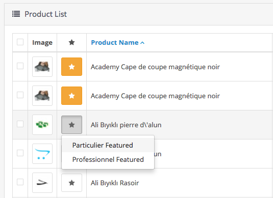
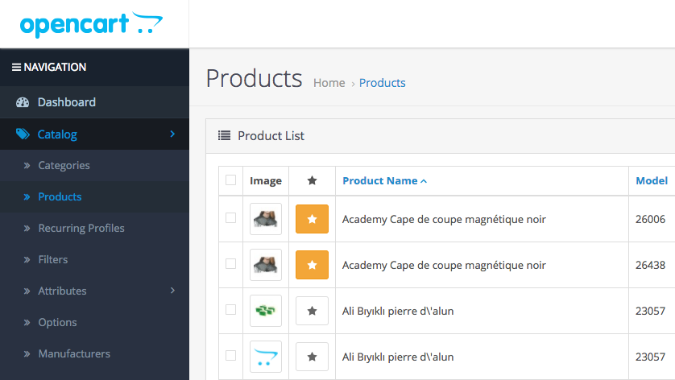

#  Easy Featured Products For Opencart 3.x

If you want to add your products to featured modules list, you can install this modification just a second.

# INSTALLATION

- Download files your computer,
- Log in your opencart admin panel
- Go to Extensions -> Installer
- Select "EasyFeatured.ocmod.zip" file from UPLOAD button
- After Installation Go to Extensions -> Modifications Click Rerresh button from top right.

# USAGE

- Go to Catalog -> Product
- You will see "STAR ICON's" on your product list. Which product you want to see in featured module just click star and select your featured list module.

For Remove a product from featured list just re-click orange colored star and confirm the message dialog.

# ISSUES

- If you couldn't see any item after click star icon : 
    - Go to Extension -> Extensiton (Select dropdown list "modules")
    - From modules list add "Featured Module" (This module opencart's default module. Not need to install)
    - After add new module go to catalog->product and use.
    
   
    

